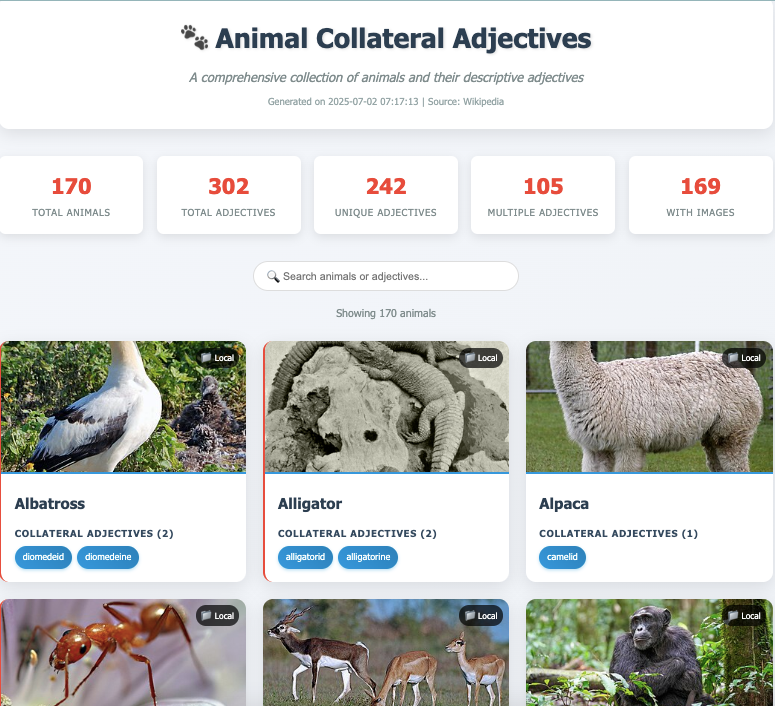

# Animal Scraper - Wikipedia Animal Names and Collateral Adjectives

A production-grade Python application that scrapes animal names and their collateral adjectives from Wikipedia, with concurrent image downloading capabilities.

## 🎯 Features

- **Web Scraping**: Extracts animal names and collateral adjectives from Wikipedia's list of animal names
- **Threading**: Concurrent image downloads using ThreadPoolExecutor for improved performance
- **Data Processing**: Validates, deduplicates, and enriches scraped data
- **Error Handling**: Comprehensive error handling with retry logic and logging
- **Production Architecture**: Modular design with clear separation of concerns

## 📋 Requirements

- Python 3.7+
- Internet connection for Wikipedia scraping and image downloads
- Write access to `/tmp/` directory for image storage

## 🚀 Installation

1. Install the required dependencies:
```bash
pip install -r requirements.txt
```

## 🏃 Usage

### Basic Usage

Run the application from the `animal_scraper` directory:

```bash
python main.py
```

### What the Application Does

1. **Scraping Phase**: Downloads and parses the Wikipedia page for animal names
2. **Processing Phase**: Validates and cleans the scraped data
3. **Download Phase**: Concurrently downloads animal images to `/tmp/`
4. **Output Phase**: Displays results in animal_report.html and logs the process

## 📁 Project Structure

```
animal_scraper/
├── main.py                      # Main application entry point
├── config.py                    # Configuration constants
├── scraper/
│   ├── __init__.py
│   └── wikipedia_animal_scraper.py   # Wikipedia scraping functionality
├── downloader/
│   ├── __init__.py
│   └── image_downloader.py      # Threaded image downloading
├── processor/
│   ├── __init__.py
│   └── animal_data_processor.py # Data validation and processing
├── formatter/
│   ├── __init__.py
│   └── html_formatter.py        # HTML formatting and display
├── utils/
│   ├── __init__.py
│   └── helpers.py               # Utility functions
├── tests/
│   ├── __init__.py
│   └── test_animal_data_processor.py             # Unit and integration tests
├── requirements.txt             # Python dependencies
└── README.md                    # Project documentation
```

## 🔧 Configuration

Key configuration options can be modified in `config.py`:

- `MAX_CONCURRENT_DOWNLOADS`: Number of simultaneous image downloads (default: 5)
- `IMAGE_DOWNLOAD_TIMEOUT`: Timeout for image downloads (default: 30 seconds)
- `REQUEST_DELAY`: Delay between requests to be respectful to Wikipedia
- `MAX_IMAGE_SIZE`: Maximum allowed image file size (default: 15MB)

## 📊 Output

The application generates several types of output:

### Console Output
- Formatted list of animals and their collateral adjectives
- Local image paths for downloaded images
- Comprehensive statistics

### File Outputs
- `animal_report.html`: Human-readable web text format
- `animal_scraper.log`: Application logs

## 🧵 Threading Implementation

The application uses Python's `ThreadPoolExecutor` for concurrent image downloads:

- **Concurrent Downloads**: Multiple images downloaded simultaneously
- **Rate Limiting**: Respectful to server resources with configurable limits
- **Error Handling**: Individual download failures don't stop the entire process
- **Retry Logic**: Automatic retries with exponential backoff for failed downloads

## 🛠️ Architecture Highlights

### Modular Design
- **Separation of Concerns**: Each module has a single responsibility
- **Clean Interfaces**: Well-defined APIs between components
- **Error Isolation**: Failures in one component don't cascade

### Professional Practices
- **Comprehensive Logging**: Detailed logging at all levels
- **Type Hints**: Full type annotations for better code clarity
- **Documentation**: Extensive docstrings and inline comments
- **Configuration Management**: Centralized configuration
- **Resource Management**: Proper cleanup of network connections

### Data Processing Pipeline
1. **Extraction**: Scrape raw data from Wikipedia
2. **Validation**: Filter out invalid entries
3. **Deduplication**: Remove duplicate animal-adjective pairs
4. **Enrichment**: Add metadata and analysis
5. **Output**: Format and display results

## 📈 Performance Features

- **Concurrent Processing**: ThreadPoolExecutor for image downloads
- **Caching**: HTTP session reuse and page caching
- **Streaming Downloads**: Memory-efficient image downloading
- **Resource Limits**: Configurable limits to prevent resource exhaustion

## 🐛 Error Handling

The application includes robust error handling:

- **Network Errors**: Automatic retries with exponential backoff
- **Parsing Errors**: Graceful handling of malformed HTML
- **File System Errors**: Proper error reporting for disk issues
- **Validation Errors**: Clear reporting of data validation failures

## 📝 Logging

Comprehensive logging is available at multiple levels:

- **Console Output**: High-level progress and results
- **Log File**: Detailed execution logs in `animal_scraper.log`
- **Debug Mode**: Modify `LOG_LEVEL` in config.py for verbose output

## 🤝 Contributing

This code demonstrates production-grade Python development practices:

- Follow PEP 8 style guidelines
- Add comprehensive docstrings
- Include type hints
- Write inline comments explaining complex logic
- Maintain the modular architecture

## 🔍 Example Run
 
```bash
$ python main.py

================================================================================
🐾 WIKIPEDIA ANIMAL NAMES AND COLLATERAL ADJECTIVES SCRAPER
================================================================================
This application demonstrates production-grade Python software engineering:
• Modular architecture with clear separation of concerns
• Threading for concurrent image downloads
• Comprehensive error handling and logging
• Data validation and processing pipeline
• Professional code structure and documentation
--------------------------------------------------------------------------------

[Application runs and displays results...]

Application completed successfully!
Check the generated output files for detailed results.
Check /tmp directory for downloaded animal images.
```

---

*This application demonstrates professional software engineering practices in Python, including modular architecture, threading, comprehensive error handling, and production-grade code structure.*
